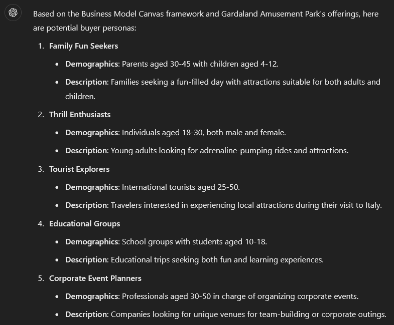
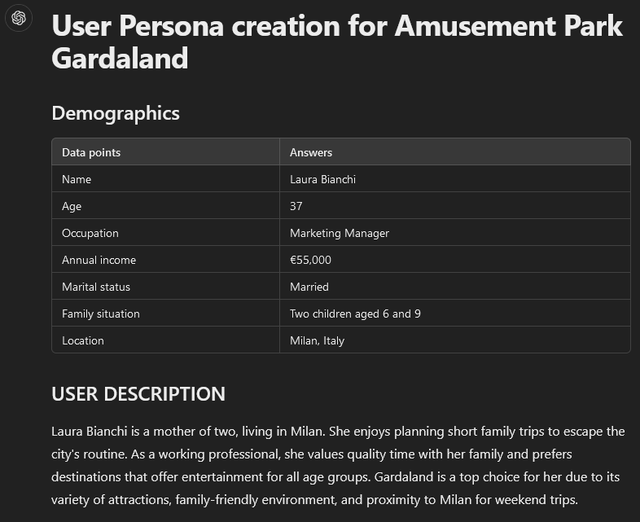
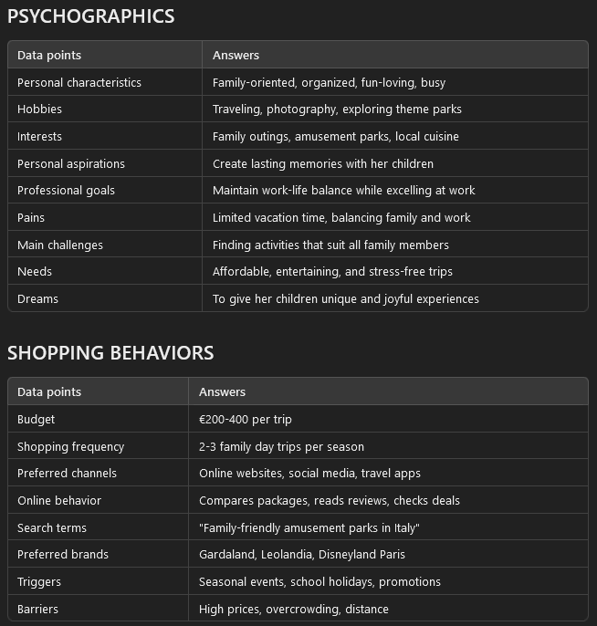

# AI Innovations in Web Marketing

<p align="center">
  <!--  style="max-width: 100%; height: auto;" height="400" -->
  
  <br>
  <i>same prompt, different images with OpenAI's Dall-E 3</i>
</p>

From May to October 2024, I was awarded a scholarship from the **University of Padua**, during which I worked as a researcher for **[SiteBySite](https://www.sitebysite.it/)**, a leading **web marketing company** with offices in Padua and Milan. My primary focus was contributing to a region-funded project aimed at integrating **advanced AI innovations** across various aspects of the company's operations. The scholarship was funded by the **Human Inspired Technologies Research Centre (HIT)**, under the guidance of professors [Alessandro Sperduti](https://www.math.unipd.it/~sperduti/) and [Marco Zorzi](https://www.dpg.unipd.it/en/marco-zorzi/).

<!-- <p align="center">
  
</p> -->

## The 3 applications of AI in Web Marketing

With [Alberto Narenti](https://www.sitebysite.it/noi/adv-team/alberto-narenti/) and [Riccardo Coni](https://www.sitebysite.it/noi/pm-team/riccardo-coni/), respectively ADV Manager and Project Manager at SiteBySite, we settled on three case studies to test the effectiveness of AI in different work areas of the company:

1. **Creation of Buyer Personas**

<p align="center">
  
  <br>
</p>

Developing buyer personas is a critical step for a company to understand its target audience. These semi-fictional representations, based on market research and real customer data, help marketers identify the preferences, behaviors, and challenges of their ideal customers. Buyer personas serve as a foundation for creating personalized and effective marketing campaigns.

2. **Generation of web blogs and Instagram posts**

<p align="center">
  
  <br>
</p>

Creating web blogs and Instagram posts is essential for building a strong online presence and engaging target audiences. By consistently generating high-quality, audience-focused content for both platforms, businesses can boost brand awareness, establish credibility, and encourage meaningful engagement, turning followers into loyal customers.

3. **Generation of infographics**

<p align="center">
  
  <br>
</p>

Infographics combine concise text, striking visuals, and data-driven insights to capture attention and enhance understanding. For a company, they serve as an effective tool to engage audiences by simplifying concepts and telling compelling stories through design.

## Creation of Buyer Personas

<p align="center">
  
  <br>
</p>

Creating buyer personas requires combining **informations about the company** and a solid **marketing knowledge**.
We researched the most popular prompts for Buyer Personas generations and settled on 3 casistisc:


| Prompt Baseline | Prompt "Dalla Bona" | Prompt KE |
|- | -| -|
| A minimalist baseline prompt | A 3-step prompt, providing 1. Segmentation, 2. Details per persona, 3. Specialist programs and topics | A complete prompt requiring demographic and psicographic details about the buyer persona |
| - | [link](https://www.linkedin.com/posts/giovannidallabona_3-prompt-per-il-marketing-ugcPost-7217823801663770624-SkR0/?utm_source=share&utm_medium=member_desktop) | [link1](https://www.youtube.com/watch?v=GwUhlpe1ri8), [link2](https://www.youtube.com/watch?v=FGF8RusTIQ0) *(they likely both found the prompt, the original source is unknown)* |

A quick commentary on each:

1. **Prompt Baseline**: will give a lot of insightful details but in a random, non-repeatable way: we have no control over the output and it will creatively decide what to include and what not to;

2. **Prompt "Dalla Bona"**: much more detailed and complete prompt. The segmentation step is clean and gives satisfying results. The profilation is nice but not as much as the one given by the 3rd prompt;

3. **Prompt KE**: a fully organized and exact prompt, which will give the same output structure at every iteration. The demographic and psicographic profilation is rich of facts and details and can be personalized freely.

### Steps to get Segmentation and Profilation of Buyer Personas through GPT

Here's the process you can follow to get a Segmentation and Profilation of a Buyer Persona for any company. 

**Step 1: Segmentation**

Below the prompt and an example of use:

```md
## Prompt

You are a Marketing expert, specialized in market segmentation, targeting, and defining buyer personas. Help me identify potential buyer personas for my business "*Business name and location*". Suggest possible Buyer Personas based on the theories of the Business Model Canvas by Alexander Osterwalder & Yves Pigneur and their segmentation methods. For each buyer persona, provide only the key elements to identify them, such as a category and a few demographic and descriptive elements.

You can look up the following websites for informations:
- *http://www.example.com/index.html*
- *...*
```

Here's an example of output with the Amusement Park Gardaland (Verona, IT):

<p align="center">
  
  <br>
  <i>same prompt, different images with OpenAI's Dall-E 3</i>
</p>

**Step 2: Profilation**

Below the prompt:

```md
## Prompt

Please respond only in the {language} language. You are a marketing researcher that writes fluent {language}. Your task is to generate a detailed USER PERSONA for the business {business}. The USER PERSONA is "{buyer_persona}" from "{place}". First write "User Persona creation for {business}" as the heading. Now create a subheading called "Demographics". Below, you need to create a table with the 2 columns and 7 rows with the following format: Column 1 = Data points (Name, Age, Occupation, Annual income, Marital status, Family situation, Location), Column 2 = Answers for each data point in Column 1 based on the specific market "{business}". Now create a subheading called "USER DESCRIPTION". Below this generate a summary of the user persona in no more than 500 characters. Now create a subheading called "PSYCHOGRAPHICS". Below this you need to create a table with 2 columns and 9 rows with the following format: Column 1 = Data points (Personal characteristics, Hobbies, Interests, Personal aspirations, Professional goals, Pains, Main challenges, Needs, Dreams), Column 2 = Answers for each data point in Column 1 based on the specific market "{business}". Now create a subheading called "SHOPPING BEHAVIORS". Below this you need to create a table with 2 columns and 8 rows with the following format: Column 1 = Data points (Budget, Shopping frequency, Preferred channels, Online behavior, Search terms, Preferred brands, Triggers, Barriers), Column 2 = Answers for each data point in Column 1 based on the specific market "{business}". Please make sure that your response is structured in 4 separate tables and has a separate row for each data point. Do not provide bullet points. Do not self reference. Do not explain what you are doing.
```

You should include the business description, or use the same chat as the previous prompt. I leave below an example of output with Amusement Park Gardaland - Verona (IT).

<p align="center">
  
  <br>
  
  <br>
  <i></i>
</p>


# Work in progress...

<p align="center">
  
  <br>
  <i>I'm in the process of writing the following of this page! Will be done soon!</i>
</p>

## Generation of web blogs and Instagram posts

<p align="center">
  
  <br>
</p>

[...]

## Generation of infographics

<p align="center">
  
  <br>
</p>

[...]

