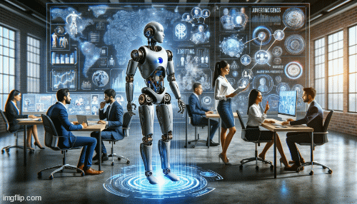

# AI Innovations in Web Marketing

  <!--  style="max-width: 100%; height: auto;" height="400" -->
  
   
  <i>same prompt, different images with OpenAI's Dall-E 3</i>

From May to October 2024, I was awarded a scholarship from the **University of Padua**, during which I worked as a researcher for **[SiteBySite](https://www.sitebysite.it/)**, a leading **web marketing company** with offices in Padua and Milan. My primary focus was contributing to a region-funded project aimed at integrating **advanced AI innovations** across various aspects of the company's operations. The scholarship was funded by the **Human Inspired Technologies Research Centre (HIT)**, under the guidance of professors Alessandro Sperduti and Marco Zorzi.

<!-- 

  

 -->

### GPT: A quick introduction

In the past few years, GPT and other large language models based on the **transformer architecture** have become fundamental tools in many applications, revolutionizing natural language processing with unparalleled performance in tasks like **text generation, translation, and coding**. In fact, both the text you're reading and the images you're seeing were generated by GPT. Fascinating, isn’t it?

GPT, or **Generative Pre-trained Transformer**, uses massive training data to predict and generate human-like text, building on the encoder-decoder attention mechanisms from the influential "Attention Is All You Need" paper. Each GPT iteration has shown significant improvements, enabling nuanced prompt understanding and **few-shot learning**. Despite its strengths, GPT outputs may need fine-tuning or validation for accuracy. Success stories highlight combining **prompt engineering** with collaborative expertise for optimal results.

  
   
  <i>The transformer architecture from the paper "Attention Is All You Need"</i>

### Work in progress...

  
   
  <i>I'm in the process of writing this page! Will be done soon!</i>

