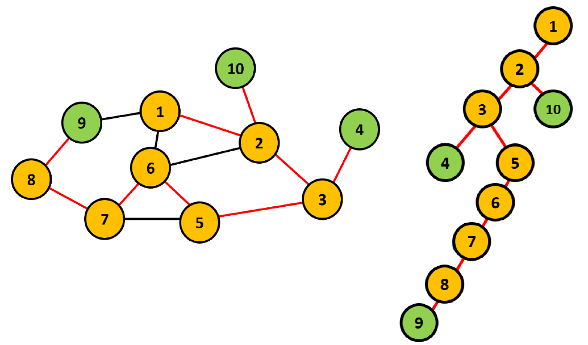
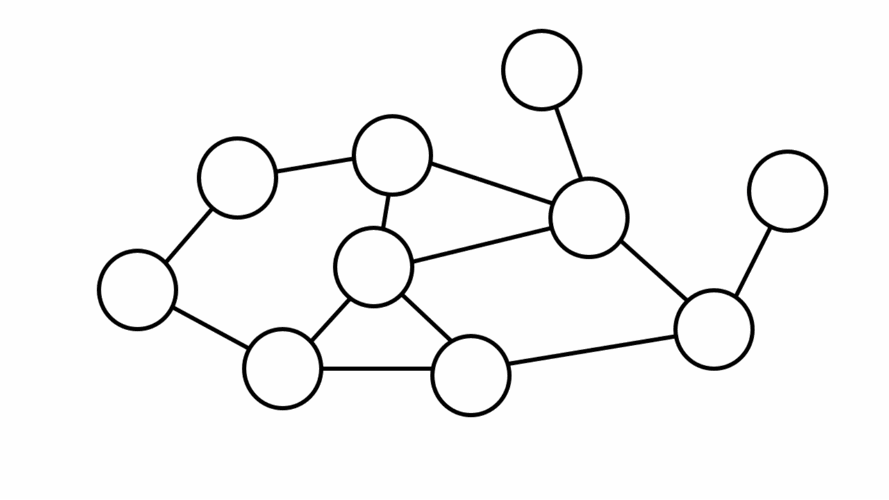
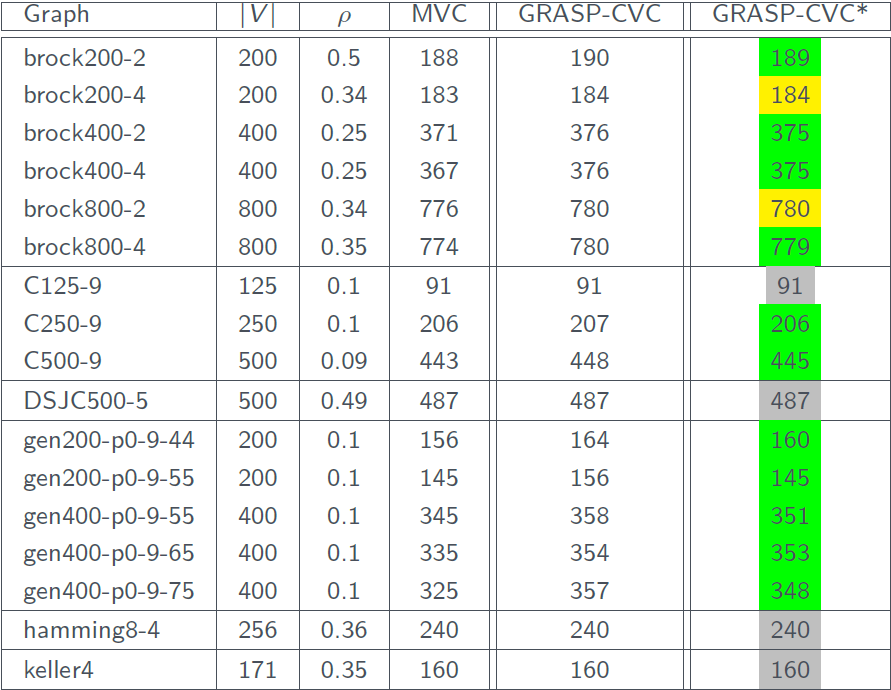

# Approximation Algorithms for Minimum Connected Vertex Covers

<p align="center">
  
</p>

## Introduction

The problem of finding minimal connected vertex covers in graphs is a classic problem in graph theory and combinatorial optimization. A ***vertex cover*** of a graph is a set of vertices such that each edge in the graph is incident to at least one vertex in the set. In other words, it's a set of vertices that covers all the edges in the graph. A ***minimum connected vertex cover*** is a vertex cover that is both connected and minimal in size. Connectedness implies that there is a path between any pair of vertices in the vertex cover.

Formally, given an undirected graph $G=(V,E)$, where $V$ is the set of vertices and $E$ is the set of edges, a ***connected vertex cover (CVC)*** of $G$ is a subset $S$ of $V$ such that every edge in $E$ is incident to at least one vertex in $S$, and the induced subgraph $G[S]$ (the subgraph of $G$ induced by the vertices in $S$) is connected. A ***minimum connected vertex cover*** $S^′$ is a connected vertex cover of $G$ such that there does not exist another connected vertex cover $S^{′′}$ with $∣S^{′′}∣<∣S^′∣$.

Finding minimal connected vertex covers is computationally challenging because it involves exploring all possible subsets of vertices to check if they form connected vertex covers and then selecting the smallest one. This problem is known to be ***NP-hard***, meaning that there is no known polynomial-time algorithm to solve it optimally. One straightforward approach is to enumerate all possible subsets of vertices, check if they form connected vertex covers, and then select the smallest one. However, this approach is not efficient for large graphs due to the exponential number of subsets. Various heuristic and approximation algorithms exist that aim to find good solutions to the problem efficiently, although they may not guarantee optimality. These algorithms often employ strategies such as local search, greedy algorithms, or dynamic programming.

The problem of finding minimal connected vertex covers has applications in various fields, including ***network design, wireless sensor networks, and computer network security***. In summary, finding minimal connected vertex covers in graphs is a fundamental problem in graph theory with practical applications and computational challenges.

## My work

Starting from these initial references:
- [1] [Introduction to vertex covers](https://www.cs.cmu.edu/~avrim/451f13/lectures/lect1105.pdf),
- [2] [Approximation algorithms analysis for VC](http://tandy.cs.illinois.edu/dartmouth-cs-approx.pdf),
- [3] [C.Savage - Depth-first search and the vertex cover problem](https://www.sciencedirect.com/science/article/abs/pii/0020019082900229),
- [4] [Y.Zhang et al. - An Efficient Heuristic Algorithm for Solving Connected Vertex Cover Problem](https://www.hindawi.com/journals/mpe/2018/3935804/),

I conducted a first theoretical work to set the mathematical foundation of the work I was going to develop. Then I implemented three algorithms to find minimum CVCs:

- The ***DFS-CVC***, proposed in [3]

- The ***GRASP-CVC***, proposed in [4]

- The ***GRASP-CVC*** *, my improved version of the GRASP-CVC.

### DFS-CVC

<p align="center">
  
</p>

The DFS-CVC consists in running the Depth First Search algorithm to define a covering tree of the graph, and then selecting the non-leaf nodes as the CVC. Proving that this set of vertices is a Vertex Cover is trivial, and similarly that it is connected.

What isn't trivial about this CVC is that it is ***at worst twice the size of the optimal solution***. This is proved rigorously in [[3]](https://www.sciencedirect.com/science/article/abs/pii/0020019082900229); if you want to practice your Italian you can also find the full proof in [my thesis](TESI_Marco_Furlan.pdf) under Chapter 2: Teoria (Teorema 4). To give a quick taste of the idea behind the proof, it boils down to proving the following chain of inequalities:

$$ |M(T)| \leq |M(G)| \leq |C(G)| \leq |NL(T)| \leq 2|M(T)| $$

Where $G$ is the graph, $T$ is the covering tree of $G$ obtained running the DFS algorithm, $M(T)$ is a maximal matching of $T$ (same for $M(G)$ ), $C(G)$ is a  minimal (vertex) cover of $G$, and $NL(T)$ is the set of non-leaf vertices of $T$. All inequalities are trivial or well-known in graph theory except $|NL(T)| \leq 2|M(T)|$, which takes the majority of the proof. With all inequalities proved, we can deduce $|NL(T)| \leq 2|M(T)| \leq 2 |C(G)|$, which means that the number of non-leaf nodes $|NL(T)|$ is at most twice the optimal solution $|C(G)|$.

Since it only uses DFS, this algorithm has $O(|V| + |E|)$ time complexity.

### GRASP-CVC

<p align="center">
  
</p>

The acronym GRASP-CVC stands for Greedy Randomized Adaptive Search Procedures for Connected Vertex Cover problem. As the name implies it is a Greedy Algorithm, which is divided into two phases: a ***GreedyConstruction*** phase and a ***LocalSearch*** phase.

- *GreedyConstruction*: During this phase a vertex is chosen with the highest degree, and then connected vertices are added gradually, choosing greedily at each step the vertex that covers the highest amount of yet uncovered edges. This repeats until all edges are covered, returning a CVC. 

- *LocalSearch*: once we have a candidate solution we move to the local search phase, during which we remove vertices that can be removed without corrupting the convering nor the connectivity, and then we methodically remove and add vertices to the CVC - carrying on a local search among the "neighbours" in the space of solutions - in hope to find another CVC which has a smaller number of vertices.

Pseudocodes for both can be found in [[4]](https://www.hindawi.com/journals/mpe/2018/3935804/), or again if you want to test your Italian also in [my thesis](TESI_Marco_Furlan.pdf) under Chapter 3: Algoritmi. This algorithm runs in $O(|V| \cdot |E|)$ time complexity[^1]. 

[^1]: under some assumptions which are always met in bigger graphs unless they are exceptionally sparse; refer to [[4]](https://www.hindawi.com/journals/mpe/2018/3935804/) or to [my thesis](TESI_Marco_Furlan.pdf) for more details.

### GRASP-CVC*

This final algorithm is my personal modification of the original GRASP-CVC, which finds consistently smaller CVCs in the same computational time. The modifications are just in a couple lines:

```
score[v] = score[v] ± (2*(v in C)-1)
```

and

```
u = random.choice([v1,v2])
```

But the effect is significant, as we can see from the table below. We highlight:

- in green better results,

- in yellow equal results,

- in red worst results (none found so far),

- in gray results that couldn't be improved (MVC stands for Mimimum Vertex Cover: it is a lower bound for Minimum CVC).

<p align="center">
  
</p>

