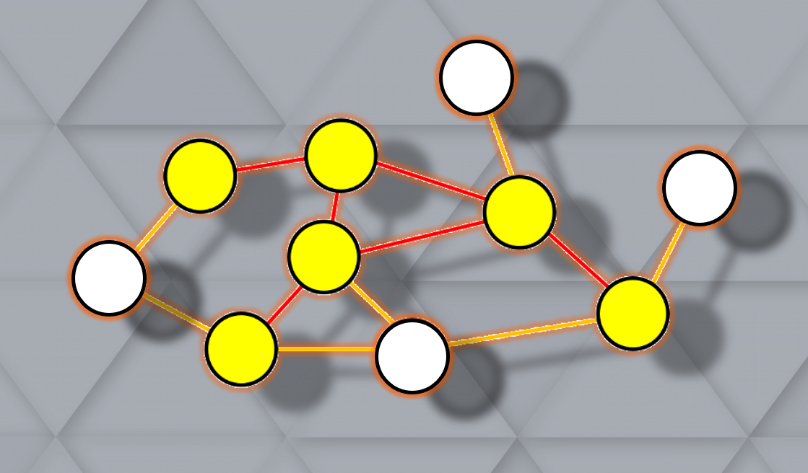

# Approximation Algorithms for Minimum Connected Vertex Covers

  

## Introduction

The problem of finding minimal connected vertex covers in graphs is a classic problem in graph theory and combinatorial optimization. A ***vertex cover*** of a graph is a set of vertices such that each edge in the graph is incident to at least one vertex in the set. In other words, it's a set of vertices that covers all the edges in the graph. A ***minimum connected vertex cover*** is a vertex cover that is both connected and minimal in size. Connectedness implies that there is a path between any pair of vertices in the vertex cover.

Formally, given an undirected graph $G=(V,E)$, where $V$ is the set of vertices and $E$ is the set of edges, a ***connected vertex cover (CVC)*** of $G$ is a subset $S$ of $V$ such that every edge in $E$ is incident to at least one vertex in $S$, and the induced subgraph $G[S]$ (the subgraph of $G$ induced by the vertices in $S$) is connected. A ***minimum connected vertex cover*** $S^′$ is a connected vertex cover of $G$ such that there does not exist another connected vertex cover $S^{′′}$ with $∣S^{′′}∣<∣S^′∣$.

Finding minimal connected vertex covers is computationally challenging because it involves exploring all possible subsets of vertices to check if they form connected vertex covers and then selecting the smallest one. This problem is known to be ***NP-hard***, meaning that there is no known polynomial-time algorithm to solve it optimally. One straightforward approach is to enumerate all possible subsets of vertices, check if they form connected vertex covers, and then select the smallest one. However, this approach is not efficient for large graphs due to the exponential number of subsets. Various heuristic and approximation algorithms exist that aim to find good solutions to the problem efficiently, although they may not guarantee optimality. These algorithms often employ strategies such as local search, greedy algorithms, or dynamic programming.

The problem of finding minimal connected vertex covers has applications in various fields, including ***network design, wireless sensor networks, and computer network security***. In summary, finding minimal connected vertex covers in graphs is a fundamental problem in graph theory with practical applications and computational challenges.

## My work

Starting from these initial references:
- [1] [Introduction to vertex covers](https://www.cs.cmu.edu/~avrim/451f13/lectures/lect1105.pdf),
- [2] [Approximation algorithms analysis for VC](http://tandy.cs.illinois.edu/dartmouth-cs-approx.pdf),
- [3] [C.Savage - Depth-first search and the vertex cover problem](https://www.sciencedirect.com/science/article/abs/pii/0020019082900229),
- [4] [Y.Zhang et al. - An Efficient Heuristic Algorithm for Solving Connected Vertex Cover Problem](https://www.hindawi.com/journals/mpe/2018/3935804/),

I conducted a first theoretical work to set the mathematical foundation of the work I was going to develop. Then I implemented two algorithms to find minimum CVCs:

- The ***DFS-CVC***, proposed in [3]

- The ***GRASP-CVC***, proposed in [4]

- The ***GRASP-CVC*** *, my improved version of the GRASP-CVC.

