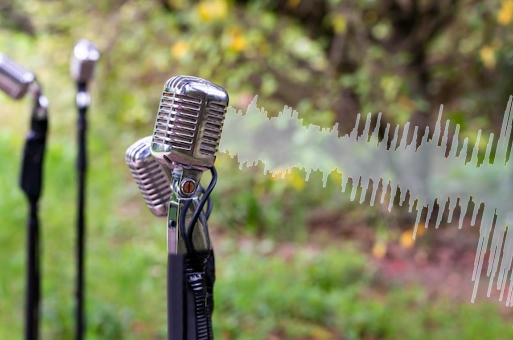
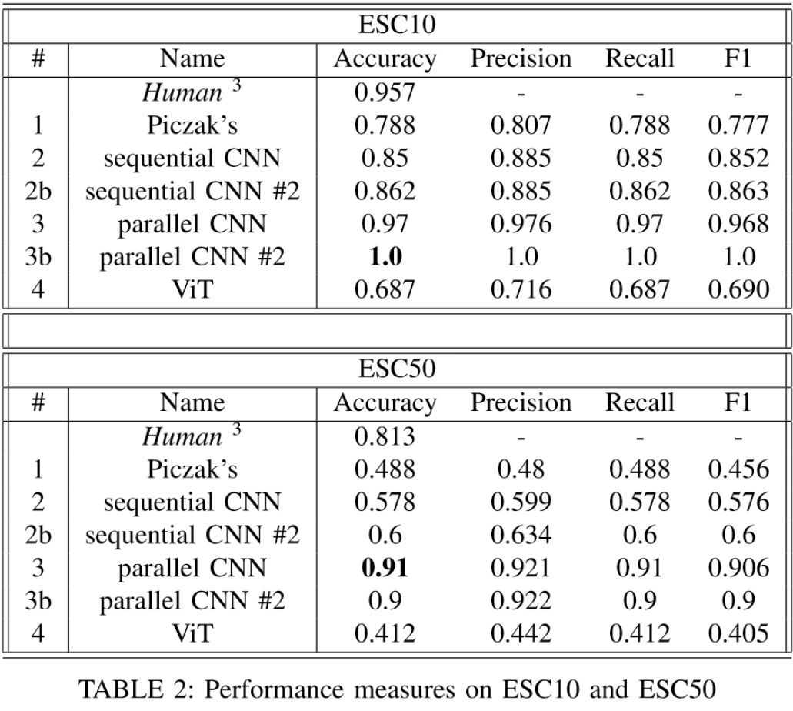

# Environmental Sound Classification

  

In this group project me and a dear friend of mine cooperated to implement and train from scratch different algorithms for the Environmental Sound Classification task. We used the [ESC50 dataset](https://github.com/karolpiczak/ESC-50) and its subset, the ESC10, and got performances up to **91% accuracy** and **100% accuracy** respectively. This would take a top 10 spot in the ranking currently shown in the [official ESC50 github](https://github.com/karolpiczak/ESC-50).

Here's what we implemented:

- classic ML models with manual feature extraction,

- [Pickzac's model](https://www.karolpiczak.com/papers/Piczak2015-ESC-ConvNet.pdf) re-implemented from scratch in Tensorflow,

- a sequential CNN,

- a parallel CNN,

- a vision transformer, which applies self-attention on fixed-size patches of the spectrogram.

***All models were trained from scratch, without use of pretrained models or external datasets***. Here I leave the [report](report.pdf) and the [presentation code](presentation.ipynb), if you are interested in the full codes they are shared [here](https://github.com/ivankrstev7/Environmental_Sound_Classification).

  

