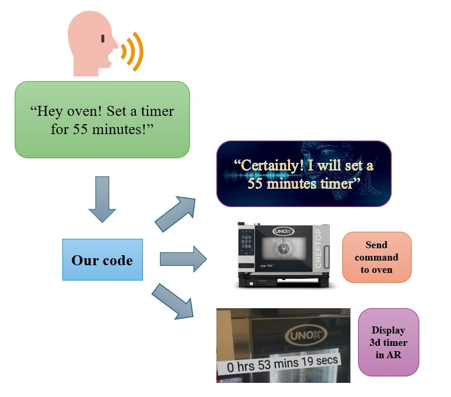
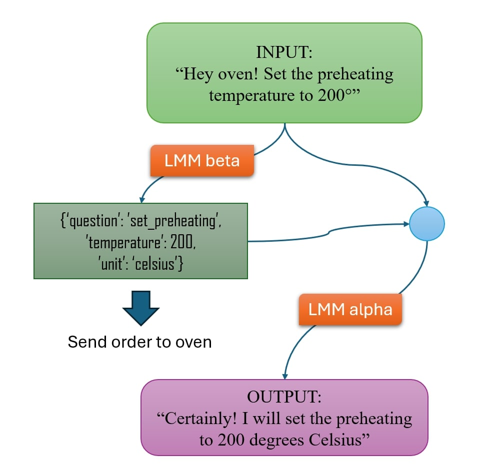

# Hackathon Unox & AWS - A 24-hour challenge to innovate with LLMs

<p align="center">
  
</p>

The Hackathon by [Unox](https://www.unox.com/) (in collaboration with [Amazon Web Services](https://aws.amazon.com)) is a 24-hour coding challenge focused on utilizing LLMs to discover feasible technical innovations for the company's user interfaces. The LLMs we used, such as [Anthropic Claude](https://www.anthropic.com/claude), [Amazon Titan](https://aws.amazon.com/it/bedrock/titan/) and [Stability AI](https://stability.ai/) were provided to us by Amazon Web Services.

Given the upcoming era of AR, me and my team came up with the idea of connecting AR smart glasses and the advanced Unox ovens to allow for a hands-free, fully voice-based control. The pipeline works as follows:

<p align="center">
  
</p>

So we needed:

1) A speech-to-text generator,

2) A text-to-command algorithm,

3) A text-to-text algorithm,

4) A functioning 3d renderer.

I was in charge of points 2 and 3. Ultimately, we succeeded in completing everything during the given 24 hours, managing to create a single model that, from a spoken command, generates an appropriate answer, a command, and initializes a timer which is displayed real-time through the camera input of the laptop or the phone!

<p align="center">
  
  
</p>

## Generative AI

My role in the team as the only Data Scientist in the group was to design and realise the pipeline which would've levered the LLM's language capabilities to understand the input, correctly send the required command to the smart oven, and return a proper output.

So I needed to engineer two separate LLMs:

- [**LLM beta**](#llm-beta), which would be responsible for the convertion from the input text to a standardized command,
- [**LLM alpha**](#llm-alpha), which would be responsible for the communication with the user.

A basic graph of the pipeline designed is shown below:

<p align="center">
  
</p>

Since this competition was in partnership with Amazon Web Services, we were enabled to use the most powerful LLMs developed that far by Amazon, Antropic Claude and Amazon Bedrock.

### LLM beta

LLM beta is the foundational model that is used right after the vocal command is converted into text. This model has the objective of converting the vocal command into a json file with the essentials of the order given to the oven. We checked the oven's API and settled for the following commands as examples of use:

| Command         | Description                      |
| --------------- | -------------------------------- |
| On_or_Off       | Turns the oven on or off         |
| Mode            | Selects oven mode                |
| Working_Time    | Asks for the current timer       |
| Humidity        | Asks for the current humidity    |
| Set_Humidity    | Sets humidity                    |
| Set_Preheat     | Sets preheat temperature         |
| Temperature     | Asks temperature                 |
| Set_Temperature | Sets current temperature         |
| Set_timer       | Sets timer                       |
| Stop_timer      | Stops timer                      |
| Not_Valid       | Command was not one of the above |

The importance of using a foundational model rather than a more primitive language processing neural network or algorithm is that the same command can be phrased in countless ways, and a deeper understanding of the language is needed to make sure the command is properly processed. Futhermore, this model can understand multiple commands at once.

Here are some examples:

| Message | LLM Beta's Output |
| -------------- | -------------- |
| "Hey Oven, turn off!" | `{Command: On_or_Off, Value: Off}` |
| "Hey Oven, you can stop now" | `{Command: On_or_Off, Value: Off}` |
| "Hey Oven, end of the day for you, see you tomorrow!" | `{Command: On_or_Off, Value: Off}` |
| "Hey Oven, set the humidity to 40%!" | `{Command: Set_Humidity, Value: 40}` |
| "Hey Oven! What is the temperature?" | `{Command: Temperature}` |
| "Hey Oven... On how many degrees are you set at the moment? | `{Command: Temperature}` |

This is the prompt I came up with:

```
Context: You are the assistent of a smart oven, taking informations from a human.
Human: Based on the above text, please don't answer, but encode the question in JSON format: Question: On_or_Off, Mode, Working_Time, Humidity, Set_Humidity, Set_Preheat, Temperature, Set_Temperature, Set_timer, or Stop_timer (else Not_Valid)
(Hours)
(Minutes)
(Seconds)
(Value: value with unit)
(Holding Time: for set preheat)
(other parameters if set).
```

A simple prompt but it got the job done. If you're interested in prompt engineering at a higher level I would recommend checking my other project on [Using GPT in Marketing](../Using%20GPT%20in%20Marketing).

### LLM alpha

Once the command is correctly registered, we want to communicate to the user the result of its request. To do so, we want to combine the original text input and the json file with the instructions sent to the oven. We want the model's response to be both coherent with the original request, and to communicate the information about the output.

This time, the prompt engineering was easier and we could settle on a short prompt powered by **RAG**, with a very basic pdf file which containes some examples of answers of the oven in different scenarios. In other words, we used RAG to define a **few-shot prompt** to promote the consistency of the model.

```
Context: you are a virtual assistant for an oven. You need to answer based on the example answers you have. Make sure to update the parameters in the answers based on the JSON file information.    
Question: {question},
JSON: {json},
Answer:
```

### Conclusion? 3rd place!🥉

<p align="center">
  
</p>

After the 24 hours were done, I took the role of speechman for my team. Thanks to the amazing job of my teammates, the judges really liked the creativity and innovation of our approach and finally decided we were worthy of our spot on the podium! This was against all odds since unlike other groups, none of us knew each other beforehand. After a confused start we combined the skills of the different people present in the group and we built a successful teamwork.

This challenge also gave me a headstart in prompt engineering, and a couple months later I accepted a 4-months scolarship as a researcher in LLM to apply prompt engineering for a digital marketing company, if you're curious to see more details check out [Using GPT in Marketing](../Using%20GPT%20in%20Marketing)!