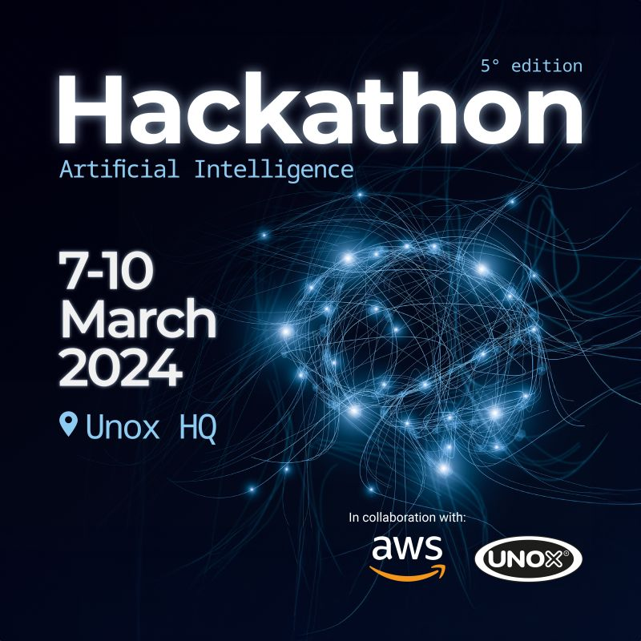
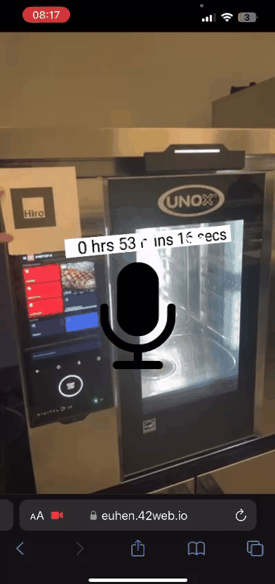

# Hackathon Unox & AWS - A 24-hour challenge to innovate with LLMs

  

The Hackathon by [Unox](https://www.unox.com/) (in collaboration with [Amazon Web Services](https://aws.amazon.com)) is a 24-hour coding challenge focused on utilizing LLMs to discover feasible technical innovations for the company's user interfaces. The LLMs we used, such as [Anthropic Claude](https://www.anthropic.com/claude), [Amazon Titan](https://aws.amazon.com/it/bedrock/titan/) and [Stability AI](https://stability.ai/) were provided to us by Amazon Web Services.

Given the upcoming era of AR, me and my team came up with the idea of connecting AR smart glasses and the advanced Unox ovens to allow for a hands-free, fully voice-based control. The pipeline works as follows:

  

So we needed:

1) A speech-to-text generator,

2) A text-to-command algorithm,

3) A text-to-text algorithm,

4) A functioning 3d renderer.

I was in charge of points 2 and 3. Ultimately, we succeeded in completing everything during the given 24 hours, managing to create a single model that, from a spoken command, generates an appropriate answer, a command, and initializes a timer which is displayed real-time through the camera input of the laptop or the phone!

  
  

## Generative AI

My role in the team as the only Data Scientist in the group was to design and realise the pipeline which would've levered the LLM language capabilities to understand the input, correctly send the required command to the smart oven, and return a proper output.

So I needed to engineer two separate LLMs:

- **LLM beta**, which would be responsible for the convertion input text --> command,
- **LLM alpha**, which would be responsible for the communication with the user (communicating whether the command was understood and what action was taken)

A basic graph of the pipeline designed is shown below:

  

The cool part about this competition being in partnership with Amazon Web Services is that we were enabled to use the LLMs developed by Amazon, that is Antropic Claude and Amazon Bedrock.