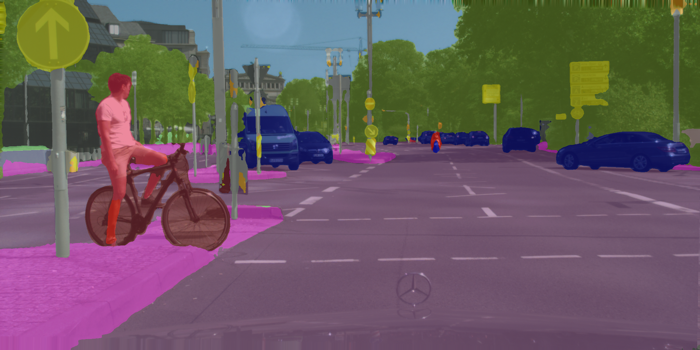

# Image Segmentation of Cityscapes

  

Image segmentation process.

In tasks such as autonomous driving and video surveillance, where understanding street scenes is essential, [semantic image segmentation](https://paperswithcode.com/task/semantic-segmentation) serves as the initial step. This process involves classifying each pixel of a high-resolution image into one of the available semantic labels, providing crucial contextual information for subsequent analysis. Given the video-based nature of these tasks, objects and individuals often undergo significant and frequent changes in scale. This poses a challenge for representing high-level features, as models must accurately encode multi-scale information.

Over the years, numerous models have been developed to tackle this demanding task. In this project, we present the results of our experiments with three such models: [DeepLabV3](https://paperswithcode.com/method/deeplabv3), [U-Net](https://arxiv.org/abs/1505.04597), and [DenseASPP](https://openaccess.thecvf.com/content_cvpr_2018/papers/Yang_DenseASPP_for_Semantic_CVPR_2018_paper.pdf). Each model employs distinct strategies and architectural implementations to effectively capture multi-scale contextual information and achieve efficient segmentations of images. For our benchmark testing, we utilized the [Cityscapes dataset](https://www.cityscapes-dataset.com/), specifically designed for street scene segmentation tasks. While all three models exhibit similar performance, DenseASPP demonstrates superior results.

[report](<https://github.com/Marco-Furlan/Projects/blob/main/Image Segmentation of Cityscapes/report.pdf>).
