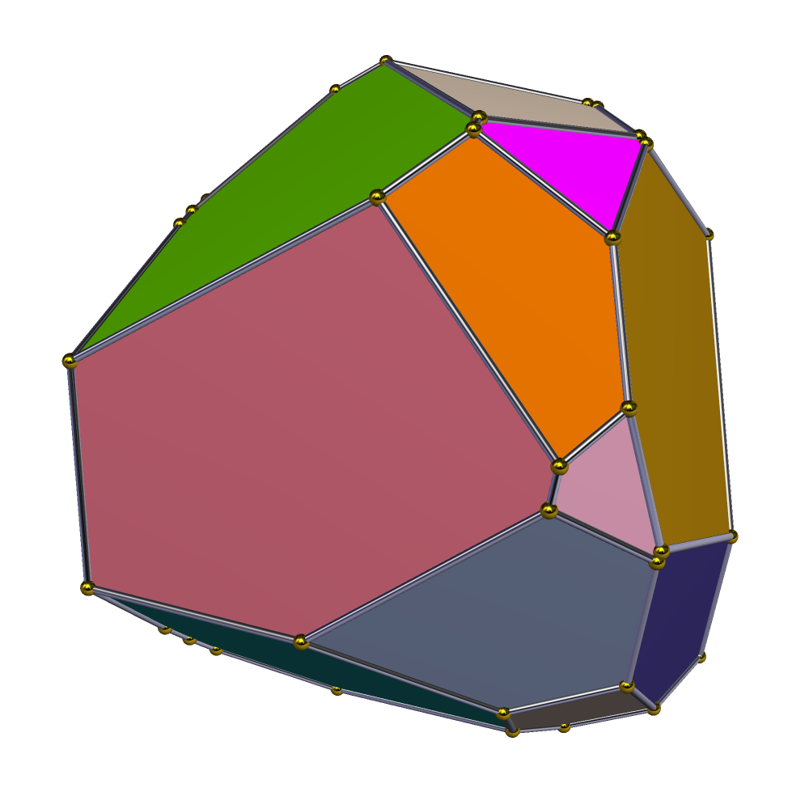
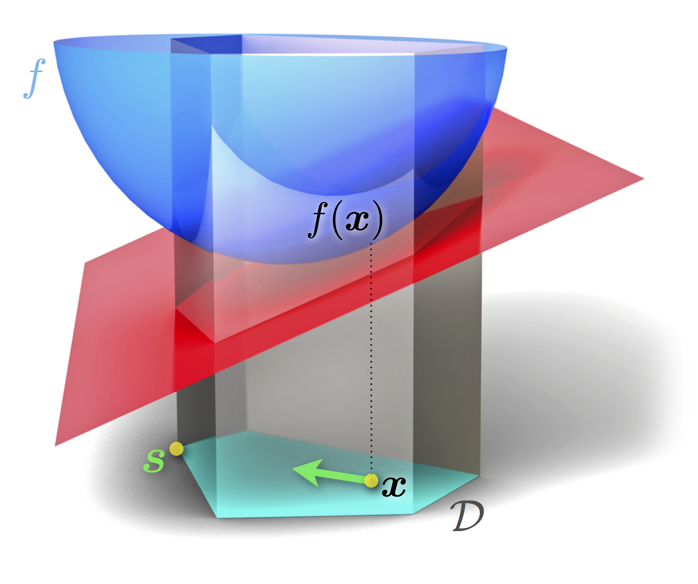

# Optimization Algorithms for Anomaly Detection

  

One of the most challenging projects I had to face this far. Me and three dear friends from my Data Science course joined our forces to unlock the mathematics behind four algorithms:

- The Away-Step Frank-Wolfe algorithm,

- The Pairwise Frank-Wolfe algorithm,

- A first $(1+\epsilon)$-approximation to MEB algorithm (Minimum Enclosing Ball),

- A second $(1+\epsilon)$-approximation to MEB algorithm.

The original group code is uploaded [here](https://github.com/Optimization-project-exam/Optimization-for-Data-Science-project). My role, code-wise, involved implementing the two Frank-Wolfe variations from scratch and testing them. We all needed to thoroughly understand the theory, and we supervised each other's work. You can check the [code](code.ipynb) or the [report](report.pdf) for more details.

    

A visualization of the Frank-Wolfe algorithm, an iterative first-order optimization algorithm for constrained convex optimization.

