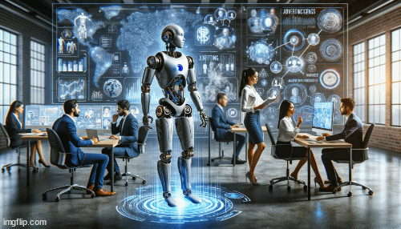

# Using GPT in Marketing

  
   
  <i>same prompt, different images with OpenAI's Dall-E 3</i>

From May to October 2024 I received a scolarship at the **University of Padua** and worked as a researcher for the **Human Inspired Technologies Research Centre - HIT**, with professors Alessandro Sperduti and Marco Zorzi. I played a key role in a project funded by the region to **implement innovation in a company**. The company in question is [SiteBySite](https://www.sitebysite.it/), a professional web marketing company situated in Padua and Milan.

<!-- 

  

 -->

### GPT: A quick introduction

In the past few years, GPT and other large language models based on the **transformer architecture** have become fundamental tools in many applications, revolutionizing natural language processing with unparalleled performance in tasks like **text generation, translation, and coding**. In fact, both the text you're reading and the images you're seeing were generated by GPT. Fascinating, isn’t it?

GPT, or **Generative Pre-trained Transformer**, uses massive training data to predict and generate human-like text, building on the encoder-decoder attention mechanisms from the influential "Attention Is All You Need" paper. Each GPT iteration has shown significant improvements, enabling nuanced prompt understanding and **few-shot learning**. Despite its strengths, GPT outputs may need fine-tuning or validation for accuracy. Success stories highlight combining **prompt engineering** with collaborative expertise for optimal results.

  
   
  <i>The transformer architecture from the paper "Attention Is All You Need"</i>

